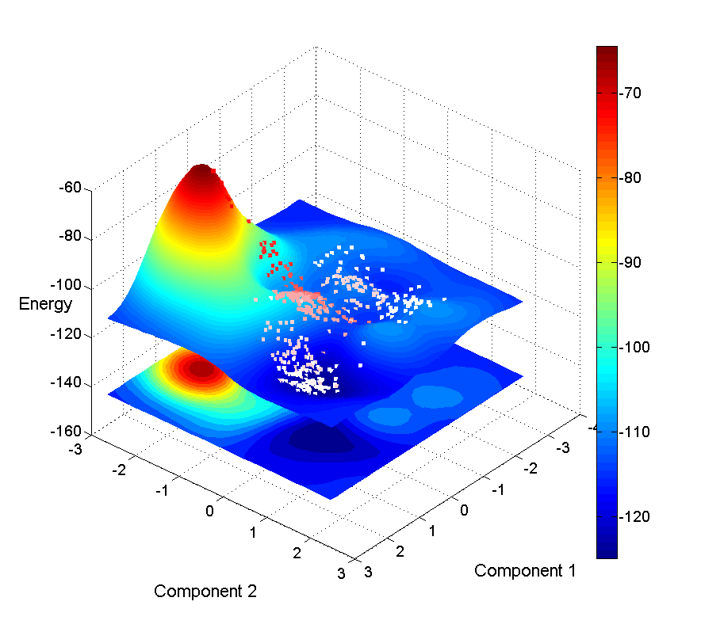
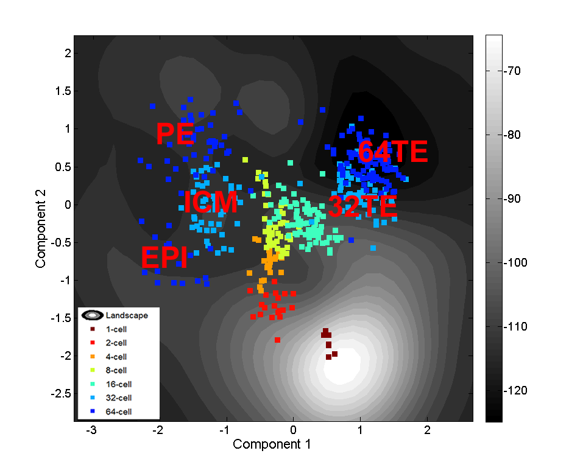
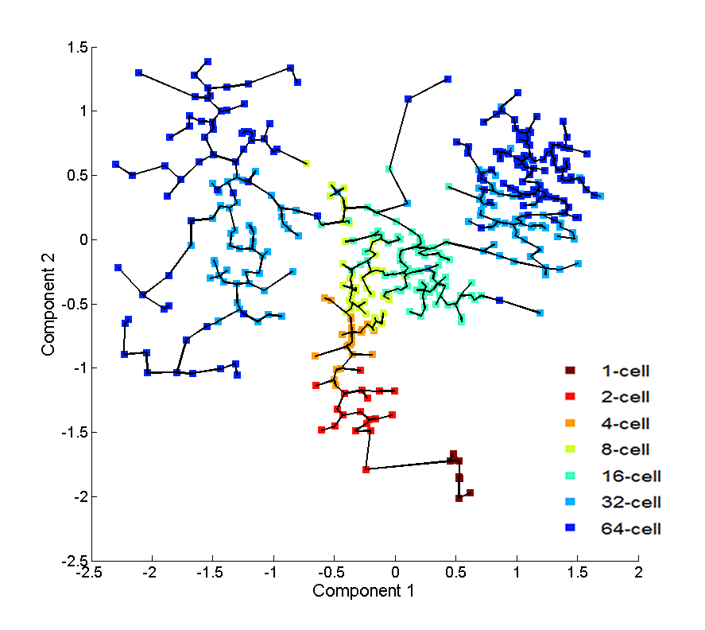

# HopLand
Single-cell pseudotime recovery using continuous Hopfield network based modeling of Waddington’s epigenetic landscape

## Dependencies
The following MATLAB packages are required:

-- fast marching toolbox: https://www.ceremade.dauphine.fr/~peyre/teaching/manifold/matlab/toolbox_fast_marching.zip
or http://histone.sce.ntu.edu.sg/HopLand/toolbox_fast_marching.zip

-- GPmat: https://github.com/SheffieldML/GPmat (It is recommended that you also include NETLAB (https://github.com/sods/netlab) as a dependency). In the "isomapEmbed.m" file under the "mltools" folder, please change line 13 from "neighbours = 7;" to "neighbours = 10;".

-- IsomapR1: https://github.com/ohadf/isomatch/tree/master/external/IsomapR1 (you can also download it from above)

After downloading the required packages, unzip them to your working directory and add the directories to your MATLAB path. 
Note: It could happen that the code in the above dependency packages might be different from the versions used in HopLand, which could lead to slightly different results of HopLand. We apologize for the confusion and inconvenience caused, and we will try to track and update such changes. If you have any question or suggestion, please feel free to contact us (Jie Zheng at zhengjie_2001@hotmail.com or zhengjiemaryland@gmail.com).

## Installation
1. Download the MATLAB source code. 
2. Unzip it to your desired location. 

## Example 

Dataset: GUO2010 

Data type: qPCR

Source: Guo G, Huss M, Tong GQ, et al. Resolution of Cell Fate Decisions Revealed by Single-Cell Gene Expression Analysis from Zygote to Blastocyst. Dev Cell. 2010. doi:10.1016/j.devcel.2010.02.012.

Number of cells: 438

Number of genes: 48

Description: Early mouse embryonic development

Stages: 1-cell, 2-cell, 4-cell, 8-cell, 16-cell, 32-cell, 64-cell stages

# Results

(a)

(b)

Figure 1. (a) The Waddington's epigenetic landscape recovered using HopLand. (b) The contour plot of the constructed Waddington's epigenetic landscape. The dots are colored according to the developmental stages of the represented cells.

Figure 2. The minimum spanning tree constructed from Waddington's epigenetic landscape. The dots are colored according to the developmental stages of the cells in the dataset of GUO2010.

## Contact
Please send your suggestions, comments, reports of bugs and errors to <a href="zhengjie_2001@hotmail.com">Jie Zheng</a>. Thank you!
